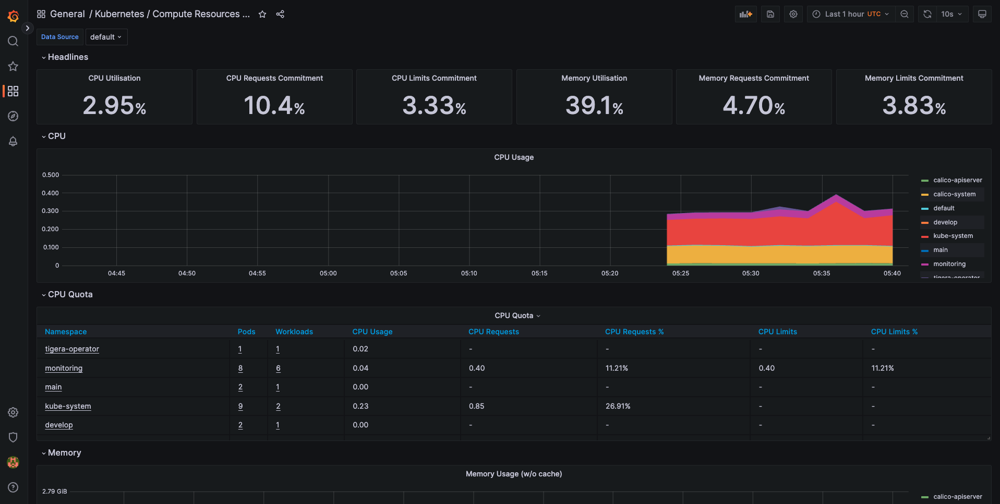
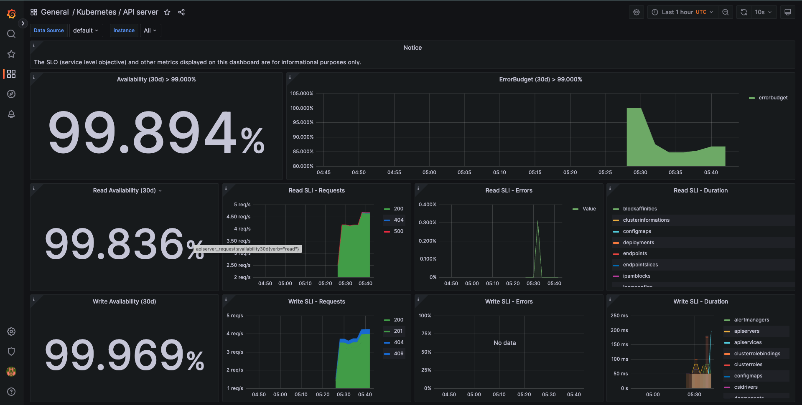

# Checklist

## Создание облачной инфраструктуры
Ожидаемые результаты:

1. Terraform сконфигурирован и создание инфраструктуры посредством Terraform возможно без дополнительных ручных действий.
https://github.com/lozovoya/diplo/blob/main/deploy/tf/main.tf

## Создание Kubernetes кластера

Ожидаемый результат:

1. Работоспособный Kubernetes кластер.

2. В файле ~/.kube/config находятся данные для доступа к кластеру.
   доступ к кластеру реализован через ssh
   https://github.com/lozovoya/diplo/blob/main/deploy/ansible/setup-cluster.yaml

3. Команда kubectl get pods --all-namespaces отрабатывает без ошибок.

```
debian@kube-master-stage:~$ k get pods -A
NAMESPACE          NAME                                                     READY   STATUS    RESTARTS      AGE
calico-apiserver   calico-apiserver-7868cfbb95-7xhrn                        1/1     Running   0             15m
calico-apiserver   calico-apiserver-7868cfbb95-wghtl                        1/1     Running   0             15m
calico-system      calico-kube-controllers-5f9dc85578-mtptb                 1/1     Running   0             16m
calico-system      calico-node-b9ckf                                        1/1     Running   0             16m
calico-system      calico-node-fwps5                                        1/1     Running   0             16m
calico-system      calico-node-tl78w                                        1/1     Running   0             16m
calico-system      calico-typha-599fd7ff7f-d5psm                            1/1     Running   0             15m
calico-system      calico-typha-599fd7ff7f-jrgtc                            1/1     Running   0             16m
calico-system      csi-node-driver-4dmz2                                    2/2     Running   0             15m
calico-system      csi-node-driver-b8kr9                                    2/2     Running   0             15m
calico-system      csi-node-driver-dkpfw                                    2/2     Running   0             16m
default            nfs-server-nfs-server-provisioner-0                      1/1     Running   0             16m
develop            diplo-app-55bdcbb779-5lls8                               1/1     Running   0             25s
develop            diplo-app-55bdcbb779-q9fjv                               1/1     Running   0             25s
kube-system        coredns-565d847f94-f2f7j                                 1/1     Running   0             16m
kube-system        coredns-565d847f94-s88d5                                 1/1     Running   0             16m
kube-system        etcd-kube-master-stage                                   1/1     Running   0             17m
kube-system        kube-apiserver-kube-master-stage                         1/1     Running   0             17m
kube-system        kube-controller-manager-kube-master-stage                1/1     Running   0             17m
kube-system        kube-proxy-gnlxh                                         1/1     Running   0             16m
kube-system        kube-proxy-hc659                                         1/1     Running   0             16m
kube-system        kube-proxy-lzslj                                         1/1     Running   0             16m
kube-system        kube-scheduler-kube-master-stage                         1/1     Running   0             17m
main               diplo-app-5949b6669f-g9nvn                               1/1     Running   0             23s
main               diplo-app-5949b6669f-k2n22                               1/1     Running   0             23s
monitoring         alertmanager-kind-prometheus-kube-prome-alertmanager-0   2/2     Running   1 (14m ago)   14m
monitoring         kind-prometheus-grafana-7885f4fcdd-h24vh                 3/3     Running   0             14m
monitoring         kind-prometheus-kube-prome-operator-6d55c6d78f-cjnts     1/1     Running   0             14m
monitoring         kind-prometheus-kube-state-metrics-6c7cfbdd47-p2qkd      1/1     Running   0             14m
monitoring         kind-prometheus-prometheus-node-exporter-b7b2b           1/1     Running   0             14m
monitoring         kind-prometheus-prometheus-node-exporter-kkncq           1/1     Running   0             14m
monitoring         kind-prometheus-prometheus-node-exporter-tbklm           1/1     Running   0             14m
monitoring         prometheus-kind-prometheus-kube-prome-prometheus-0       2/2     Running   0             14m
tigera-operator    tigera-operator-64db64cb98-5n9tx                         1/1     Running   0             16m
```

## Создание тестового приложения

Ожидаемый результат:

1. Git репозиторий с тестовым приложением и Dockerfile. https://github.com/lozovoya/diplo2/blob/main/main.go

2. Регистр с собранным docker image. В качестве регистра может быть DockerHub или Yandex Container Registry, созданный также с помощью terraform (использован github registry)


## проект реализован в 2-х репозиториях:
1. инфраструктура (terraform и ansible) https://github.com/lozovoya/diplo

2. приложение написанное на go, выводит html страницу с приветствием https://github.com/lozovoya/diplo2


## Подготовка cистемы мониторинга и деплой приложения

Ожидаемый результат:

1. Git репозиторий с конфигурационными файлами для настройки Kubernetes. https://github.com/lozovoya/diplo/blob/main/deploy/ansible/playbooks/monitoring/kube-prometheus-stack.yaml

2. Http доступ к web интерфейсу grafana. http://158.160.57.250:31000/

3. Дашборды в grafana отображающие состояние Kubernetes кластера.




4. Http доступ к тестовому приложению.   http://158.160.57.250:30895/

## Установка и настройка CI/CD

Ожидаемый результат:

1. Интерфейс ci/cd сервиса доступен по http.

2. При любом коммите в репозиторие с тестовым приложением происходит сборка и отправка в регистр Docker образа. https://github.com/lozovoya/diplo2/blob/main/.github/workflows/diplo-app-develop.yaml

3. При создании тега (например, v1.0.0) происходит сборка и отправка с соответствующим label в регистр, а также деплой соответствующего Docker образа в кластер Kubernetes. https://github.com/lozovoya/diplo2/blob/main/.github/workflows/diplo-app-main.yaml

# описание деплоя инфраструктуры

для развертывания серверов и сетевой инфраструктуры в яндекс облаке используется terraform, state хранится в облаке. для разделения prod и dev сред используется terraform workspace.

в репозитории настроен workflow отслеживающий изменния инфраструктуры. изменения применяются автоматически, для этого в github actions прокинуты необходимые ключи.

для инсталляции kubernetes используется ansible playbook ansible/setup-cluster.yaml

 playbooks/debian-prepare-server.yaml - общая подготовка серверов
 
 playbooks/install-nodes.yaml - инстал пакетов
 
 playbooks/control-plane.yaml - настройка master ноды
 
 playbooks/node.yaml - настройка worker нод
 
 playbooks/monitoring/kube-prometheus-stack.yaml - установка и настройка kube-prometheus-stack
 
 playbooks/deploy.yaml - деплой приложения с помощью helm. оно лежит архивом во второй репе.


# описание деплоя приложения

 использованы 2 ветки: develop и main, ветка main защищена от прямых merge, изменения только через PR.
 github actions настроены на push/merge для develop ветки и на tag для main ветки
 для хранения образов использован github repository

